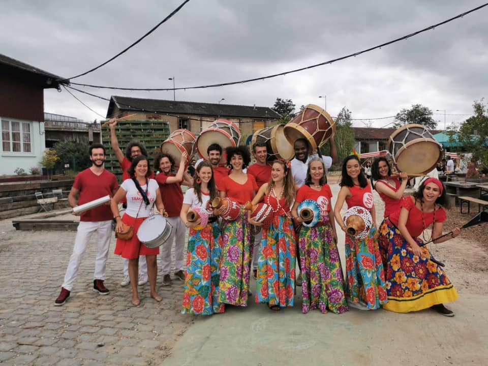
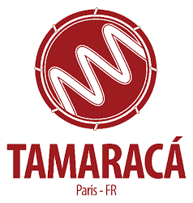

	

		

			

				<h1 style="color: red; display: inline-block;">Tamaraca</h1>
        
<h4 style="color: black; display: inline-block;">tous les mardi à 20h – Studio Bleu</h4>

				
Tamaraca développe un travail de pédagogie collective de recherche concernant le Maracatu de baque virado. Cette approche s’inspire de la pédagogie du Trovão das Minas de Belo Horizonte, mais résulte aussi des expériences de ses membres au Brésil et aussi des stages avec des Mestres et membres des naçoes de Maracatu de baque virado , et de professeurs et chercheurs de ce style musical. De plus Tamaraca a des liens avec les groupes percussifs Trovão das Minas, Rio Maracatu, Cia Caracaxa Quintal Escambo Cultural.

				

      

			
 
		

	

	

		

			

				<figure class="wp-block-image size-large">
					
				</figure>
			

			

				<h2 class="wp-block-heading">Administré par l’Association&nbsp;Patakori (ex-Toda Nação Paris), le&nbsp;projet Tamaraca s’articule autour&nbsp;de 2 axes principaux qui sont :</h2>
				
1) la diffusion de la culture&nbsp;populaire traditionnelle du&nbsp;Maracatu de baque virado

				
2) le développement d’un réseau&nbsp;d’échange culturel entre les&nbsp;groupes percussifs de Maracatu&nbsp;en Europe, au Brésil et sur les autres&nbsp;continents, au delà des Nations de&nbsp;Maracatu qui constituent la source&nbsp;vive de cette culture.

				
Tamaraca a été fondé en août 2010&nbsp;par Celso Soares, percussioniste&nbsp;brésilien, et Ana-Maria&nbsp;Constantinescu, ancienne Présidente&nbsp;de l’association Patakori, à l’issue&nbsp;d’une série d’ateliers de maracatu de&nbsp;baque virado. La création du groupe&nbsp;a permis de concrétiser le projet&nbsp;d’échange culturel entre le public&nbsp;français, le groupe Trovão das Minas&nbsp;et le Maracatu Nação Estrela&nbsp;Brilhante de Recife.&nbsp;Le coordinateur musical, Celso&nbsp;Soares, membre du Maracatu Nação&nbsp;Estrela Brilhante de Recife, ancien&nbsp;coordinateur musical du groupe&nbsp;Trovão das Minas et actuel directeur&nbsp;musical du groupe Baque de Mina.&nbsp;Le groupe organise des répétitions et&nbsp;des cours qui ont lieu depuis plus de six&nbsp;ans au Studio Bleu, studio de&nbsp;répétitions de renommée&nbsp;internationale.&nbsp;Avec ses activités localisées dans le&nbsp;centre de Paris,Tamaraca&nbsp;a&nbsp;développé un lien étroit avec la vie&nbsp;culturelle et les manifestations de la&nbsp;municipalité. Le groupe a déjà&nbsp;participé en formation de bloc à des&nbsp;événements culturels et des défilés de&nbsp;rue dans les différents arrondissements&nbsp;de Paris et s’est également présenté&nbsp;fréquemment sur scène.&nbsp;Les cours hebdomadaires du&nbsp;maracatu&nbsp;sont toujours dispensés par&nbsp;des musiciens expérimentés et&nbsp;régulièrement par des musiciens&nbsp;brésiliens de référence invités&nbsp;spécialement par l’association Patakori&nbsp;pour des périodes de résidence à Paris.&nbsp;Au&nbsp;delà de ces activités régulières,&nbsp;l’association a déjà organisé de&nbsp;multiples ateliers événementiels avec&nbsp;des Mestres de Maracatu Nation et&nbsp;des professeurs de groupes brésiliens&nbsp;de passage en Europe.

			

		
